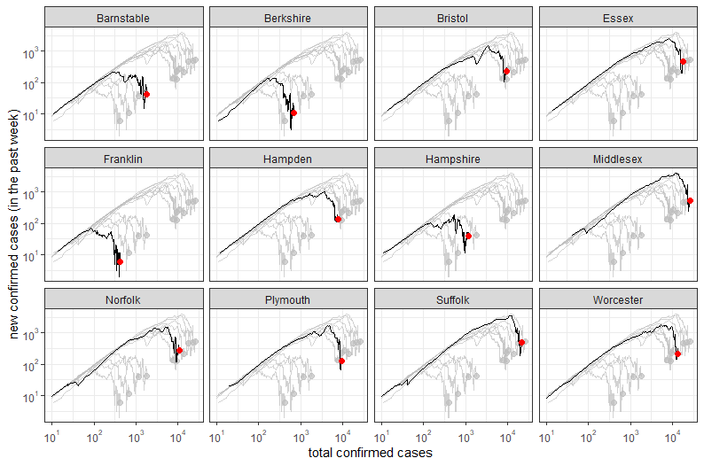

## ggplot2 example

Inspiration for this example was taken from [MinutePhysics](https://www.youtube.com/watch?v=54XLXg4fYsc) and [Aatish Bhatia](http://aatishb.com/covidtrends/).

Plots were created on the morning of July 10, 2020.

The .R file can be found [here](https://github.com/jmhatch/R-Shiny-Working-Group/blob/master/materials/ggplot2_example/R/ggplot2_example.R).

### 1) load libraries
```R
library(dplyr)
library(readr)
library(magrittr)
library(RcppRoll)
library(ggplot2)
library(ggrepel)
library(scales)
library(gghighlight)
library(gganimate)
```

### 2) download county-level aggregated data from NY Times
```R
nyt_data = 'https://raw.githubusercontent.com/nytimes/covid-19-data/master/us-counties.csv' %>% url %>% read_csv
```

### 3) filter to get Massachusetts data
```R
ma_nyt = nyt_data %>% filter(state == 'Massachusetts')
```

### 4) reverse the cumulative sum of covid-19 counts and name that column new_cases
```R
ma_nyt %<>% group_by(county) %>% arrange(date) %>% mutate(new_cases = c(cases[1], diff(cases))) %>% ungroup()
```

### 5) take a weekly rolling sum of new_cases
```R
ma_week = ma_nyt %>% group_by(county) %>% arrange(date) %>% mutate(week_sum = RcppRoll::roll_sum(new_cases, 7, align = 'right', fill = NA)) %>% ungroup()
```

### 6) set minimum number of total confirmed cases to 10
```R
ma_week %<>% filter(cases >= 10)
```

### 7) remove data where county is unknown or Martha's Vineyard or Nantucket
```R
ma_week %<>% filter(!county %in% c('Unknown', 'Dukes', 'Nantucket'))
```

### 8) plot
```R
ggplot(data = ma_week, aes(x = cases, y = week_sum, group = county)) +
  geom_line(color = 'grey') +
  scale_x_log10() +
  scale_y_log10() +
  theme_bw() +
  xlab('total confirmed cases') + 
  ylab('new confirmed cases (in the past week)') + 
  geom_text_repel(data = ma_week %>% filter(date == max(date)), aes(label = county)) +
  geom_point(data = ma_week %>% filter(date == max(date)), color = 'red') 
```


### yet another way to plot
```R
ggplot(data = ma_week, aes(x = cases, y = week_sum, group = county)) +
  geom_line() + 
  geom_point(data = ma_week %>% filter(date == max(date)), size = 2, color = 'red') +
  facet_wrap(~county) + 
  gghighlight(county == county, use_direct_label = FALSE) +
  scale_x_log10(labels = trans_format('log10', math_format(10^.x))) +
  scale_y_log10(labels = trans_format('log10', math_format(10^.x))) +
  theme_bw() +
  xlab('total confirmed cases') + 
  ylab('new confirmed cases (in the past week)')
```



### 9) animate
```R
anime = ggplot(data = ma_week, aes(x = cases, y = week_sum, group = county)) + 
    geom_line(color = 'grey') +
    geom_point(size = 2, color = 'red') +
    geom_text_repel(aes(label = county)) +
    transition_reveal(date) +
    scale_x_log10() +
    scale_y_log10() +
    theme_bw() +
    xlab('total confirmed cases') + 
    ylab('new confirmed cases (in the past week)') + 
    labs(title = "Date: {format(frame_along, '%Y-%m-%d')}")

anime
```


## Credits
Data on COVID-19 provided by [The New York Times](https://github.com/nytimes/covid-19-data). Many thanks to the New York Times for making this invaluable resource publicly available!
